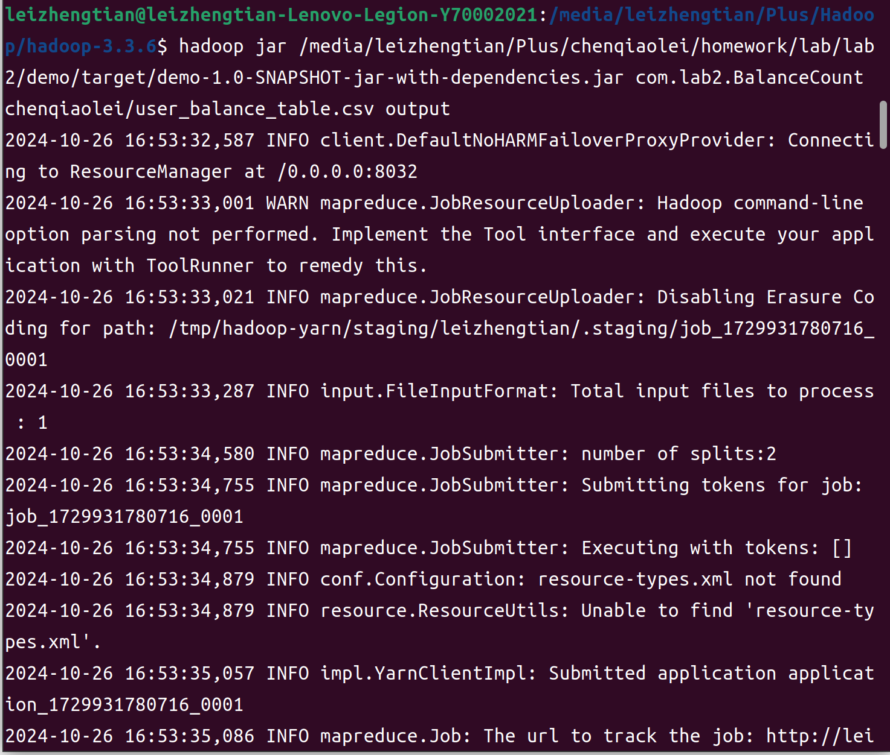
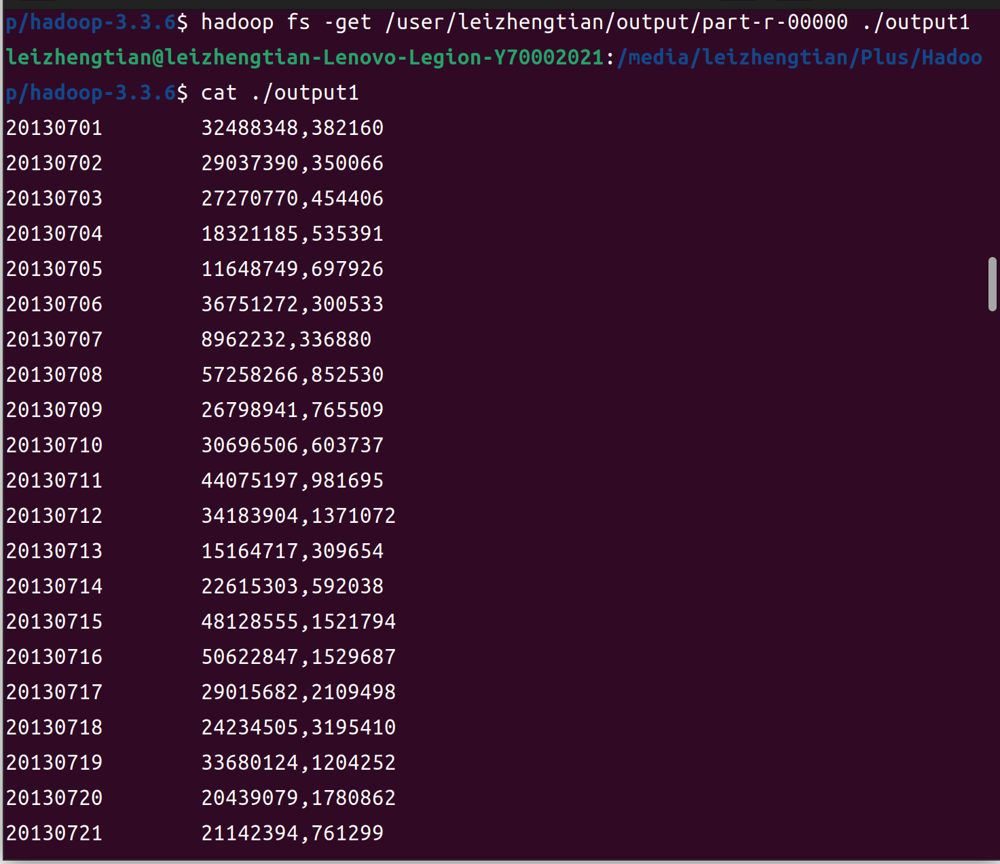
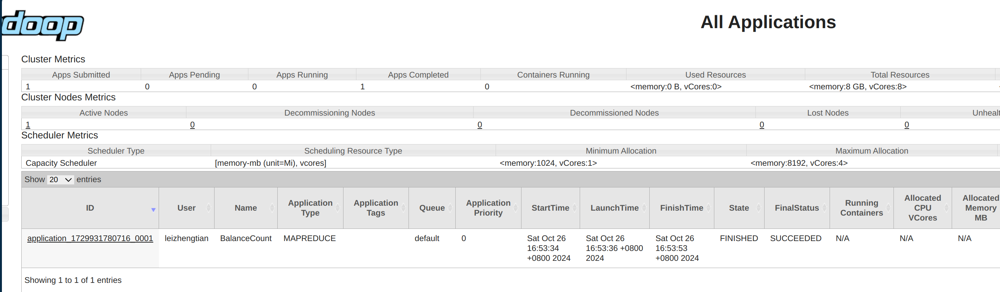
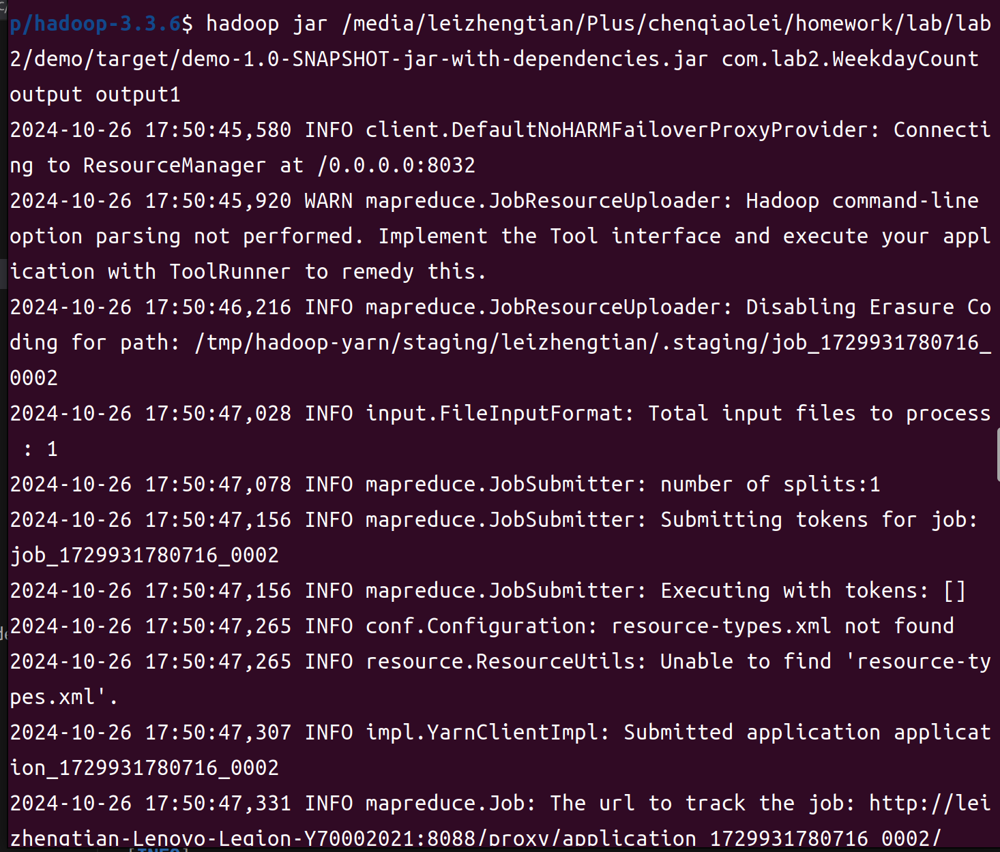
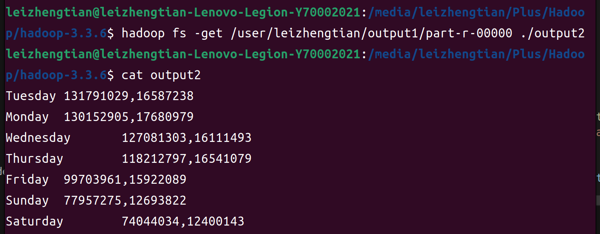
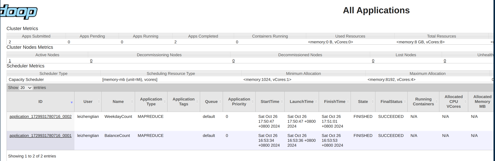
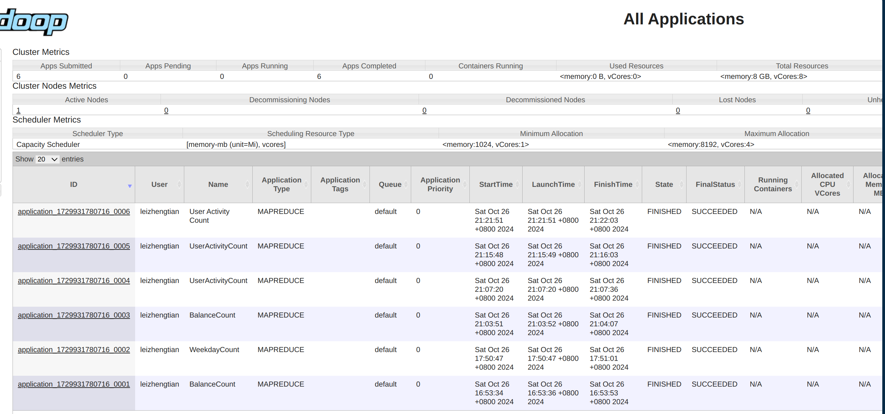
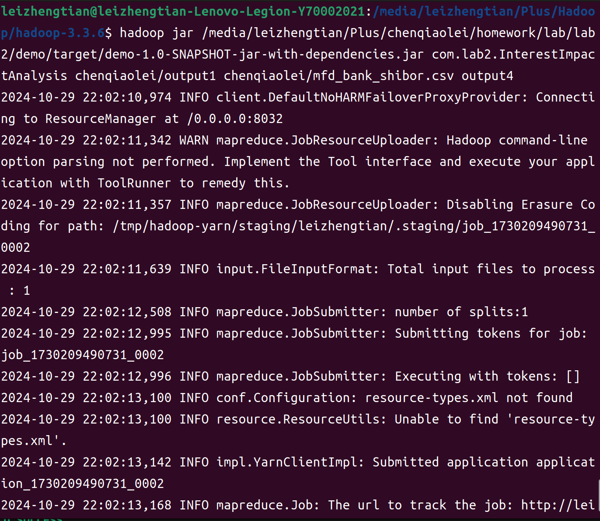
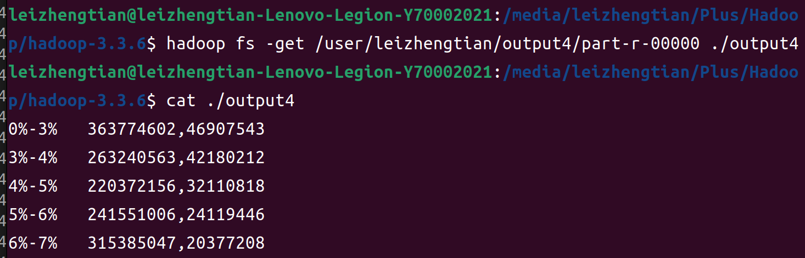
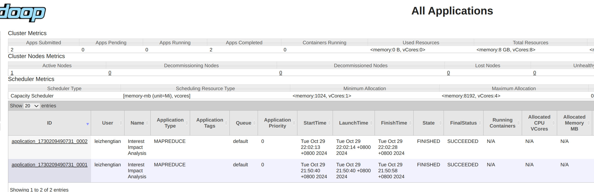

# 项目概述
金融大数据处理技术**实验二**（by 221275024-陈巧蕾）

本项目基于Hadoop MapReduce编写了一系列数据分析任务，旨在从用户余额和银行利率数据中挖掘交易行为的统计信息和趋势。包含四个独立的MapReduce任务,具体设计思路以及运行结果如下。

# 任务一：每⽇资⾦流⼊流出统计
文件路径为： `/src/main/java/com/lab2/BalanceCount.java` 

## 设计思路
  统计 user_balance_table.csv 表中的数据，编写MapReduce程序，统计所有⽤户每⽇的资⾦流⼊与
流出情况。

#### Mapper
  按日期分类输出资金的流入量和流出量。具体步骤包括：

  跳过文件头行：通过key.get() == 0的判断，Mapper会直接跳过第一行，确保仅处理数据行。

  字段提取与验证：代码通过String.split(",")将每行数据按逗号分割成字段数组。程序先判断是否至少有11个字段，以确保数据完整性。

  数据预处理：提取第2列作为日期，第5列和第10列作为资金的流入量和流出量。考虑到可能存在空值的情况，设计时加入了对空值的处理，若为空则默认值设为0。

  输出键值对：Mapper的输出采用<日期, 流入量,流出量>的形式，将相同日期的流入流出量集中在一起，为Reducer阶段的汇总做准备。

#### Reducer
对Mapper输出的数据按日期汇总流入量和流出量。过程具体如下：

  首先定义两个累加变量totalInflow和totalOutflow，分别用于汇总每个日期的资金流入量和流出量。

  然后对同一日期的所有数据项，提取出流入量和流出量字段，将字符串转为long类型后累加到计数器中。这种设计通过遍历Iterable<Text>对象，将一天的资金数据汇总为一个统计值。

  输出结果：按<日期, 总流入量,总流出量>的格式输出，将每个日期的资金汇总数据写入最终结果。

## 运行结果

在终端运行mapreduce程序：

将输出结果保存在 `/output/output1`文件中，并在终端显示输出结果：

在页面查看运行结果：

# 任务二：星期交易量统计
java文件路径为 `/src/main/java/com/lab2/WeekdayCount.java` 

## 设计思路
  任务是统计每个星期几（Monday, Tuesday, ..., Sunday）的资金流入和流出量，并计算它们的平均值。最终的输出会根据流入量进行排序。
  
#### Mapper
  将输入数据（user_balance_table.csv）解析后，输出按星期几分组的资金流入和流出量。

  具体步骤如下：

    1.日期解析：利用SimpleDateFormat将日期字符串（格式为yyyyMMdd）解析为Date对象。然后，使用Calendar类提取出该日期对应的星期几。

    2.根据解析出的星期几，将流入量和流出量分别输出为两条记录：一个记录表示该星期几的资金流入量：key = "星期几_inflow"，value = 流入量。另一个记录表示该星期几的资金流出量：key = "星期几_outflow"，value = 流出量。

#### Reducer
  对相同星期几的流入量和流出量进行汇总，并计算它们的总和和平均值。

  **具体步骤如下**：

  1.汇总流入量和流出量。遍历每个key（星期几和流入/流出类型）及其对应的values（资金流入或流出量）。根据key的类型（inflow或outflow），分别对流入量和流出量进行累加。与此同时，还要记录每个星期几的数据条数。

  2.计算每个星期几的资金流入量和流出量的平均值。average_inflow = total_inflow / count

      average_outflow = total_outflow / count

  3.将每个星期几的流入量和流出量的平均值写入输出，输出格式为<星期几, 平均流入量, 平均流出量>。

#### 排序
  在cleanup方法中，程序按照星期几的流入量进行降序排序，流入量最多的星期几排在最前面。排序使用Java 8的Stream API实现。

## 运行结果

在终端运行mapreduce程序：

将输出结果保存在`/output/output2`文件中，并在终端显示输出结果：

在页面查看运行结果：

# 任务三：⽤户活跃度分析
java文件路径为: ` /src/main/java/com/lab2/UserActivityCount.java` 

## 设计思路
  在所有用户的活跃天数都被统计出来后，需要对键值对中的值进行排序，从而倒序输出.
  
  采用的方法是：先统计活跃天数到临时文件，然后在外部使用 sort 命令对最终结果文件进行降序排列。也就是先将统计到的所有<用户id，活跃天数>输出到dfs的一个文件夹内如output，然后使用命令：hadoop fs -cat output/* | sort -k2,2nr > sorted_output。从而根据活跃天数倒序排列的结果会存放到本地的sort_output文件内.

#### Mapper
功能：解析 user_balance_table 表中的每一行数据，判断用户是否活跃。

过程：

跳过文件头：如果输入的键为0（即文件的第一行），则直接跳过，避免处理CSV文件头。

字段解析：将每行数据通过逗号分隔，并检查列数以确保数据完整。

用户行为判断：提取direct_purchase_amt（直接购买量）和total_redeem_amt（总赎回量）字段。
若这两个字段中任意一个非空且大于0，表明用户当天有活动，输出<userId, 1>。

输出格式：<userId, 1>表示该用户当天活跃。Mapper最终输出的键为userId（用户ID），值为1（表示当天活跃）。

#### Reducer

功能：对每个用户的活跃天数进行汇总。

逻辑：
统计活跃天数：对同一用户（相同userId）的所有值求和，统计该用户的活跃天数。
输出格式：输出<userId, activeDays>，表示每个用户的活跃天数。

在输出结果中引入一个额外的排序步骤，例如使用-r参数（在HDFS CLI中）或将结果导入到数据库中按activeDays降序排序。

## 运行结果

运行hadoop程序，将最终的输出结果保存在` /output/sorted_output3 `文件中。用cat命令输出文件内容，部分截图如下：

对应的页面状态截图为：

# 任务四：交易⾏为影响因素分析
java文件路径为: `/src/main/java/InterestImpactAnalysis.java`
## 设计思路

  本任务选择数据集 mfd_bank_shibor.csv 中的银行2周利率 Interest_2_W ，先对csv文件中 Interest_2_W 这一列的数值进行观察，发现数值都在2%到8%之间.从而可以将2周利率划分为不同的区间，统计每个区间下的⽇均资⾦流⼊和流出总量，从而分析利与交易资⾦量之间的关系。

  并且在任务一中已经统计了每一日的总资金流入量和资金流出量，因此可以将任务一的结果（output1文件）进行复用.

  #### Mapper 设计
  输入：
    output1资金流文件的每一行，格式为 <日期> TAB <资⾦流⼊量>,<资⾦流出量>

     mfd_bank_shibor.csv 银行利率文件，每一行的结构为 <mfd_date, Interest_O_N, Interest_1_W, Interest_2_W, ...>

  过程：

    将 mfd_bank_shibor.csv 文件中的日期（作为键）和对应的两周利率（Interest_2_W）存储在 interestRateMap 哈希表中，便于在 map 中快速查找。

    定义利率区间划分函数getRateRange（rate），功能是根据 rate 的值，将利率分配到对应的区间。对于每一个日期date，通过 interestRateMap.get(date) 获取该日期对应的利率，并通过 getRateRange(rate) 获取利率区间名称。

    将利率区间名称作为键、将“流入量、流出量、1（表示一天）”组合为字符串作为值输出给 Reducer。

  #### Reducer 设计
  **目的** ：对每个利率区间下的资金流入和流出数据进行统计，计算日均资金流入和流出量
  
  过程：
    
    对于每个利率区间（即 key），遍历所有传入的 values，从每个 value 中提取流入量、流出量和天数，将它们分别累加到 totalInflow、totalOutflow 和 days 中。

    累加完成后，依旧总天数 days ，使用计算公式“日均流入 = 总流入 / 天数，日均流出 = 总流出 / 天数“即可计算该利率区间下的平均流入量和平均流出量。

    将利率区间名称作为 key，计算得到的平均流入和流出量拼接为字符串作为 value，输出给 HDFS 中指定的结果路径。

## 运行结果

在终端运行mapreduce程序。

将输出结果保存在`/output/output4`文件内。并用cat方法显示输出结果：

在页面查看运行结果（由于和前面几个任务不是在同一天完成的，因此页面只能展示任务四程序的运行结果）：

# 可以改进的地方

1. 对于任务一和任务二，可以考虑在Mapper阶段添加一个Combiner以减少数据传输，优化性能。

2. 当前实现中，利率区间是硬编码的。可以考虑根据数据集中的利率分布根据最大最小值，划分为若干个区间，从而能够应对未知数据分布的输入。或者还可以将区间划分的逻辑参数化，通过命令行参数传入，让用户自主定义划分区间。